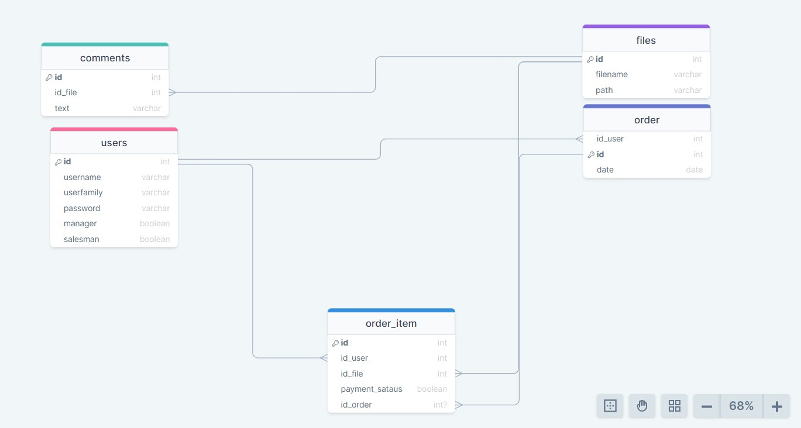
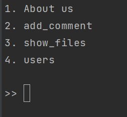
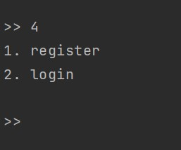

# فروشگاه فایل مکتب ۷۸
**دومین میکرو پروژه پایتون خام (پایانی پایتون - قبل از فلسک)**
---
---


##ERD project



---


### Program menu





---


##Menu explanation:


```text
The program menu includes four options.
First option: About the program
where the specifications of the program version are located.
The second option: Add a comment
You can leave several comments for each file in this store and there is no limit.
Third option: show files
From this section, you can see the files in the store.
Fourth option: users
that this section contains several nested sections and from this section both users and sellers can enter and do their work.
The main part of the menu is this option
```


---


##Users section



```text
In this section, a user can register and if he has registered,
 he can enter his user account to make a purchase.
 Files can be purchased by logging into the user account.
Through login, sellers can add more files to the store or remove a file from the store.
```


---


##Store database

```text
The store database file is ready to be restored in a folder next to the project.

```


---


